# 🏗️ ERP Paketin Cargo — Master Plan

> **Dokumen Perencanaan Penggabungan 3 Sistem Menjadi 1 ERP Terpadu**
> Versi: 1.0 | Tanggal: 19 Agustus 2026

---

## 📋 Daftar Isi

1. [Analisis Sistem Existing](#1-analisis-sistem-existing)
2. [Arsitektur ERP Gabungan](#2-arsitektur-erp-gabungan)
3. [Diagram Penggabungan](#3-diagram-penggabungan)
4. [Daftar Modul Lengkap](#4-daftar-modul-lengkap)
5. [ERD (Entity Relationship Diagram)](#5-erd-entity-relationship-diagram)
6. [Sistem Role & Permission](#6-sistem-role--permission)
7. [Konfigurasi Branch/Cabang](#7-konfigurasi-branchcabang)
8. [Mobile App (Khusus Absensi)](#8-mobile-app-khusus-absensi)
9. [Rencana Migrasi (Fase Eksekusi)](#9-rencana-migrasi-fase-eksekusi)
10. [UI/UX Design System](#10-uiux-design-system)

---

## 1. Analisis Sistem Existing

### 1.1 CRM-Paketin (Port 8001)
| Aspek | Detail |
|-------|--------|
| **Framework** | Django 6.1 (Server-Side Rendering) |
| **Database** | SQLite (dev) / MySQL (prod) |
| **Auth** | Default Django User (`django.contrib.auth.models.User`) |
| **User Model** | `DEFAULT_AUTO_FIELD` (Integer PK) |
| **Template** | Bootstrap 5 + Crispy Forms |
| **Deployment** | Hostinger (cPanel + Passenger) |

**Django Apps:**
| App | Model Utama | Fungsi |
|-----|-------------|--------|
| `accounts` | `UserProfile` (OneToOne → User, FK → Branch) | Profil user, link ke cabang |
| `core` | `Branch` (name, code, city, province, is_active) | Master data cabang |
| `sales` | `Client`, `Lead`, `Contract` | Manajemen pelanggan B2B, pipeline sales, kontrak |
| `quotation` | `Quotation`, `QuotationItem` | Penawaran harga, kalkulasi volumetrik |
| `activity` | `Activity`, `Reminder` | Log aktivitas sales, reminder follow-up |
| `dashboard` | *(no model)* | Dashboard analytics |
| `notifications` | `Notification` | Notifikasi in-app |
| `audit` | `AuditLog` | Audit trail semua perubahan |

**RBAC yang sudah ada (via Groups):**
- `Admin` / `is_superuser` / `is_staff` → Akses semua data
- `Supervisor` / `Manager` → Akses semua data
- `Kepala Cabang` → Akses data di cabang sendiri
- `Sales` (Regular User) → Hanya data milik sendiri

---

### 1.2 System-Finance (Port 8002)
| Aspek | Detail |
|-------|--------|
| **Framework** | Django 6.1 + DRF (REST API) + Vite (Frontend SPA) |
| **Database** | MySQL (`system_finance`) |
| **Auth** | Custom User (`accounts.User` → `AbstractUser`, UUID PK) |
| **User Model** | `UUID` Primary Key |
| **Template** | SPA (Single Page Application via `index.html` + Vite) |

**Django Apps:**
| App | Model Utama | Fungsi |
|-----|-------------|--------|
| `accounts` | `User` (UUID, FK → Role), `Role`, `ColumnPermission` | User management, role-based column access |
| `finance` | `Profile`, `KpiFile`, `KpiSheet`, `KpiFinance`, `CellStyle`, `AuditLog`, `CrmClient`, `CrmContract` | Data keuangan (KPI spreadsheet-style), integrasi CRM |

**Poin Penting Finance:**
- Sudah ada integrasi CRM via webhook (`crm_lead_id`, `CrmClient`, `CrmContract`)
- Data finance berbasis spreadsheet-like (KPI Sheets → rows of `KpiFinance`)
- Kolom-kolom: `awb`, `pengirim`, `penerima`, `service`, `via`, `aktual/vol/unit/kubik`, `harga`, `surcharge`, `packing`, `penjualan`, `vendor_i-iv`, `ops`, `asuransi`, `total_biaya`, `profit`
- Role: `admin`, `pic`, `viewer` + Column-level permission

---

### 1.3 HR-Paketin (Port 8000)
| Aspek | Detail |
|-------|--------|
| **Framework** | Django 6.1 + DRF + SimpleJWT |
| **Database** | MySQL (`hr_paketin`) |
| **Auth** | Custom User (`accounts.User` → `AbstractUser`, UUID PK, login via email) |
| **User Model** | `UUID` Primary Key, `USERNAME_FIELD = 'email'` |
| **Mobile** | Flutter (Web + Mobile) |

**Django Apps:**
| App | Model Utama | Fungsi |
|-----|-------------|--------|
| `accounts` | `User` (UUID, email login), `Role` (M2M), `MenuPermission`, `MenuVisibilitySetting` | Auth, role management, per-menu visibility setting |
| `organizations` | `Branch`, `Department`, `Position` | Struktur organisasi (branch punya lat/lng, radius absen, jam kerja) |
| `employees` | `Employee`, `RegisteredDevice`, `FaceProfile` | Data karyawan, device fingerprint, face recognition |
| `attendance` | `AttendancePolicy`, `AttendanceEvent` | Kebijakan absensi, log check-in/check-out |
| `leave` | `LeaveType`, `LeaveBalance`, `LeaveRequest` | Manajemen cuti |
| `approvals` | `ApprovalFlow`, `ApprovalStep`, `ApprovalRequest`, `ApprovalAction` | Approval workflow generic (bisa untuk cuti, dll) |
| `documents` | `DocumentCategory`, `Document`, `DocumentVersion` | Manajemen dokumen karyawan |
| `notifications` | `Notification` (actor, url, read_at), `NotificationPreference` | Pusat Notifikasi Web UI (`/notifications/`) & Dispatcher Aktivitas per Role |
| `audit` | `AuditLog` | Audit trail sistem terpusat |
| `reports` | *(empty)* | Reporting (belum diimplementasi) |

---

## 2. Arsitektur ERP Gabungan

### 2.1 Keputusan Arsitektur

| Keputusan | Pilihan | Alasan |
|-----------|---------|--------|
| **User Model** | Custom `AbstractUser` dengan UUID PK, login via email | Mengikuti pola HR-Paketin yang paling matang |
| **Database** | MySQL Tunggal (`erp_paketin`) | Satu database, satu sumber kebenaran |
| **Backend** | Django 6.1 + DRF | Konsisten dengan semua project existing |
| **Frontend Web** | Server-Side Rendering (Django Templates + Bootstrap 5) | Mengikuti CRM yang sudah terbukti stabil |
| **Frontend Finance** | Tetap SPA (Vite) embedded di dalam Django | Finance butuh interaktivitas spreadsheet-like |
| **Mobile** | Flutter (khusus absensi) | Tetap seperti HR-Paketin |
| **Auth Mobile** | JWT (SimpleJWT) | Tetap seperti HR-Paketin |
| **Auth Web** | Session-based | Tetap seperti CRM & HR web |

### 2.2 Struktur Project

```
erp-paketin/
├── manage.py
├── config/                     # Project settings
│   ├── settings.py
│   ├── urls.py
│   ├── wsgi.py
│   └── asgi.py
│
├── apps/
│   ├── accounts/               # 🔑 Auth & User (UNIFIED)
│   ├── organizations/          # 🏢 Branch, Department, Position
│   ├── employees/              # 👤 Employee profiles, devices, face
│   │
│   ├── crm/                    # 📊 CRM Module (dari crm-paketin)
│   │   ├── clients/            # Client management
│   │   ├── leads/              # Pipeline sales
│   │   ├── contracts/          # Kontrak
│   │   ├── quotations/         # Penawaran harga
│   │   └── activities/         # Log aktivitas & reminder
│   │
│   ├── operations/             # 🚛 BARU: Operasional Logistik
│   │   ├── shipments/          # Waybill/Resi pengiriman
│   │   ├── manifests/          # Manifest & surat jalan
│   │   ├── tracking/           # Tracking status
│   │   └── fleet/              # Kendaraan & armada
│   │
│   ├── finance/                # 💰 Finance (dari System-Finance)
│   │   ├── transactions/       # Data transaksi (KpiFinance)
│   │   ├── invoicing/          # Invoice & billing
│   │   ├── vendors/            # Vendor management
│   │   └── reports/            # Laporan keuangan
│   │
│   ├── hr/                     # 👥 HR (dari HR-Paketin)
│   │   ├── attendance/         # Absensi
│   │   ├── leave/              # Cuti
│   │   ├── documents/          # Dokumen karyawan
│   │   └── approvals/          # Approval workflow
│   │
│   ├── notifications/          # 🔔 Notifikasi Terpusat
│   ├── audit/                  # 📝 Audit Log Terpusat
│   ├── dashboard/              # 📈 Dashboard per role
│   └── reports/                # 📊 Laporan global
│
├── templates/                  # Django templates
├── static/                     # Static files (CSS/JS)
├── media/                      # Uploaded files
└── mobile/                     # Flutter app (absensi only)
```

---

## 3. Diagram Penggabungan

### 3.1 Peta Migrasi Modul

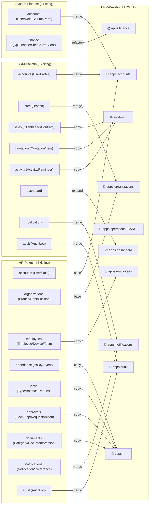

### 3.2 Alur Bisnis End-to-End

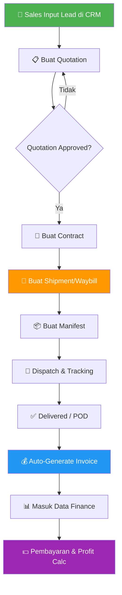

### 3.3 Arsitektur Teknis

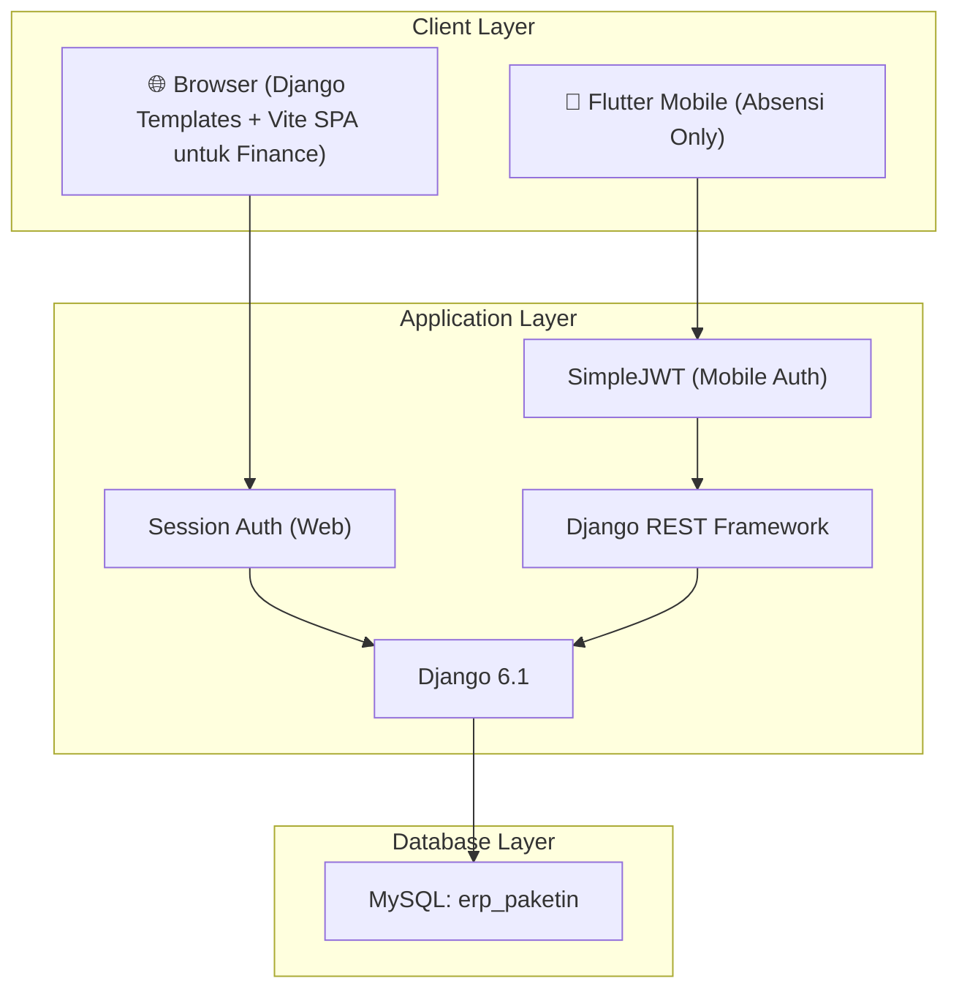

---

## 4. Daftar Modul Lengkap

### 4.1 Modul dari CRM-Paketin (Sudah Ada)

| # | Modul | Fitur | Status |
|---|-------|-------|--------|
| 1 | **Client Management** | CRUD client, kategori, status, industri, paketin group | ✅ Pindahkan |
| 2 | **Lead Pipeline** | Lead tracking, sumber lead, shipping detail, response metrics, WhatsApp/Email follow-up | ✅ Pindahkan |
| 3 | **Contract Management** | Nomor kontrak auto-generate, reminder expiry, dokumen kontrak | ✅ Pindahkan |
| 4 | **Quotation** | Kalkulasi volumetrik, multi-item, manual total, attachment, approval flow | ✅ Pindahkan |
| 5 | **Activity & Reminder** | Log aktivitas (Call/WA/Email/Visit/Meeting), reminder personal | ✅ Pindahkan |
| 6 | **Dashboard CRM** | Analytics pipeline sales, performance per sales | ✅ Pindahkan |

### 4.2 Modul dari System-Finance (Sudah Ada)

| # | Modul | Fitur | Status |
|---|-------|-------|--------|
| 7 | **Finance Transaction** | Data transaksi spreadsheet-like (KPI), multi-sheet, cell styling, formula | ✅ Refactor |
| 8 | **Vendor Tracking** | Multi-vendor per transaksi (vendor I-IV), biaya vendor | ✅ Pindahkan |
| 9 | **Profit Calculation** | Penjualan - total_biaya = profit, index profit | ✅ Pindahkan |
| 10 | **CRM Integration** | Import data dari CRM (client, contract, lead) | ⚡ Jadi native link (bukan API) |

### 4.3 Modul dari HR-Paketin (Sudah Ada)

| # | Modul | Fitur | Status |
|---|-------|-------|--------|
| 11 | **Organization Structure** | Branch (lokasi GPS, radius, jam kerja), Department, Position | ✅ Pindahkan |
| 12 | **Employee Management** | Profil karyawan, device registration, face profile | ✅ Pindahkan |
| 13 | **Attendance** | Policy per branch, check-in/out GPS + face, anti-fake | ✅ Pindahkan |
| 14 | **Leave Management** | Tipe cuti, kuota, pengajuan, approval 2-level | ✅ Pindahkan |
| 15 | **Approval Workflow** | Generic approval engine (flow → steps → action) | ✅ Pindahkan |
| 16 | **Document Management** | Dokumen karyawan, versioning, kategori | ✅ Pindahkan |

### 4.4 Modul Baru (Akan Dibuat)

| # | Modul | Fitur | Status |
|---|-------|-------|--------|
| 17 | **Shipment / Waybill** | Pembuatan resi, detail barang (berat/dimensi/jenis), asal-tujuan, link ke client & quotation | 🆕 Baru |
| 18 | **Manifest & Dispatch** | Grouping shipment ke manifest/surat jalan, assign driver/kendaraan | 🆕 Baru |
| 19 | **Tracking** | Status tracking per shipment (Pickup → Transit → Delivered), POD (Proof of Delivery) | 🆕 Baru |
| 20 | **Fleet Management** | Data kendaraan, jadwal maintenance, log bahan bakar | 🆕 Baru |
| 21 | **Invoicing** | Auto-generate invoice dari shipment/manifest, payment tracking, aging AR/AP | 🆕 Baru |
| 22 | **Unified Dashboard** | Dashboard per role (Admin, Sales, Ops, Finance, HR) | 🆕 Baru |

---

## 5. ERD (Entity Relationship Diagram)

### 5.1 Core & Auth Domain

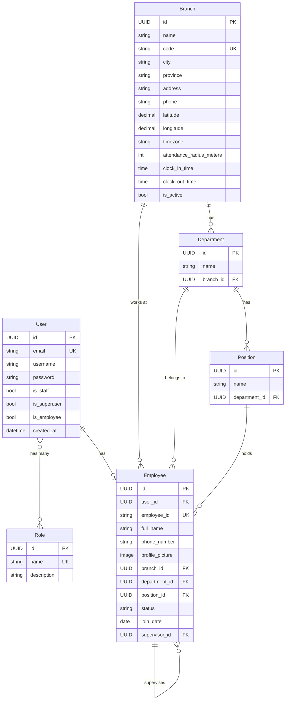

### 5.2 CRM Domain (dari CRM-Paketin)

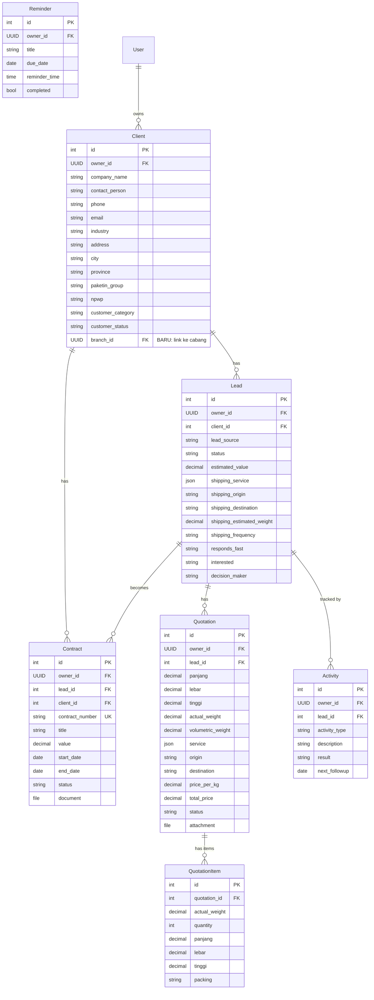

### 5.3 Operations Domain (BARU)

```mermaid
erDiagram
    Shipment {
        int id PK
        string waybill_number UK
        int client_id FK
        int contract_id FK
        int quotation_id FK
        UUID branch_origin_id FK
        UUID branch_destination_id FK
        string origin_city
        string destination_city
        string service_type
        string consignee_name
        string consignee_phone
        string consignee_address
        string goods_description
        int total_colly
        decimal actual_weight
        decimal volumetric_weight
        decimal chargeable_weight
        decimal price_per_kg
        decimal insurance_fee
        decimal packing_fee
        decimal surcharge
        decimal total_price
        string status
        string payment_type
        UUID created_by FK
        UUID pickup_by FK
        datetime pickup_date
        text notes
    }

    ShipmentItem {
        int id PK
        int shipment_id FK
        decimal panjang
        decimal lebar
        decimal tinggi
        decimal actual_weight
        int quantity
        string description
        string packing_type
    }

    Manifest {
        int id PK
        string manifest_number UK
        UUID branch_id FK
        string origin_city
        string destination_city
        string transport_mode
        int vehicle_id FK
        UUID driver_id FK
        date departure_date
        date arrival_date
        string status
        text notes
        UUID created_by FK
    }

    ManifestItem {
        int id PK
        int manifest_id FK
        int shipment_id FK
        int sort_order
    }

    TrackingEvent {
        int id PK
        int shipment_id FK
        string status
        string location
        text description
        UUID updated_by FK
        datetime event_time
        file pod_photo
    }

    Vehicle {
        int id PK
        UUID branch_id FK
        string plate_number UK
        string vehicle_type
        string brand_model
        int capacity_kg
        int capacity_cbm
        date registration_expiry
        date kir_expiry
        string status
    }

    VehicleMaintenanceLog {
        int id PK
        int vehicle_id FK
        date maintenance_date
        string maintenance_type
        decimal cost
        string description
        int next_km
    }

    Shipment ||--o{ ShipmentItem : "has items"
    Manifest ||--o{ ManifestItem : "groups"
    ManifestItem }o--|| Shipment : "contains"
    Shipment ||--o{ TrackingEvent : "tracked"
    Vehicle ||--o{ Manifest : "used by"
    Vehicle ||--o{ VehicleMaintenanceLog : "maintained"
    Client ||--o{ Shipment : "sends"
    Contract ||--o{ Shipment : "based on"
```

### 5.4 Finance Domain (dari System-Finance — Refactored)

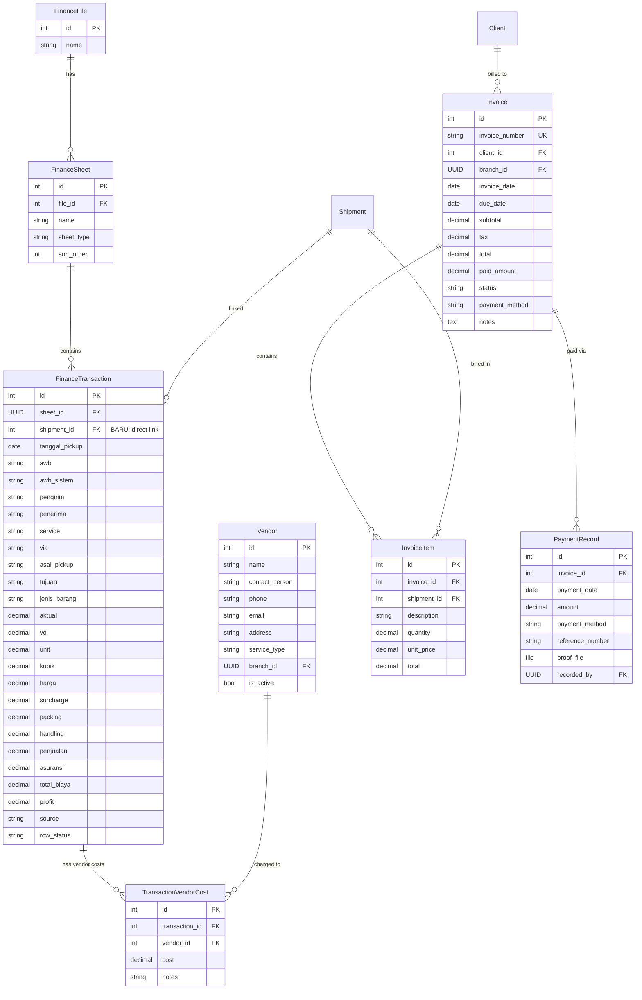

### 5.5 HR Domain (dari HR-Paketin)

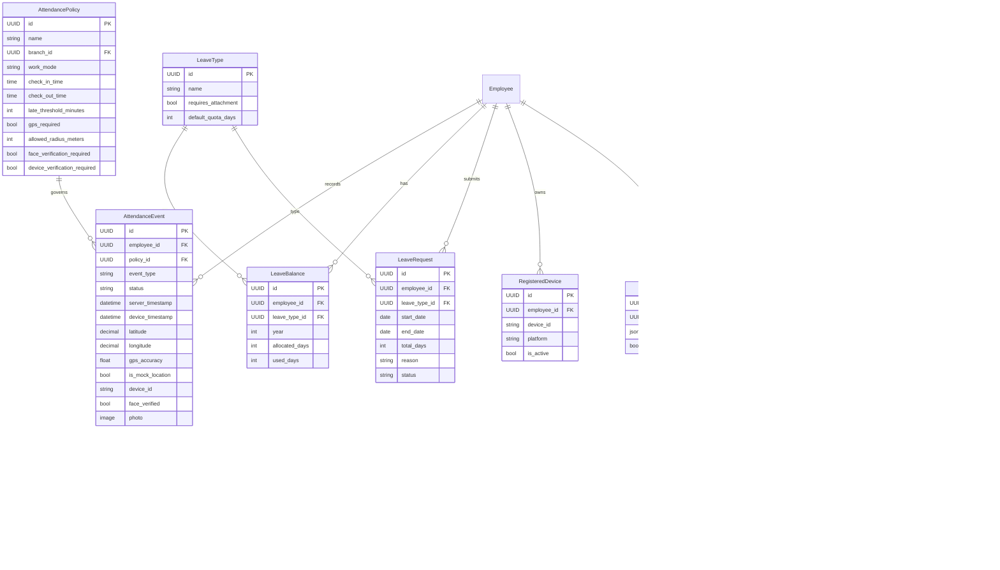

### 5.6 Cross-Module Relationships (ERD Penghubung)

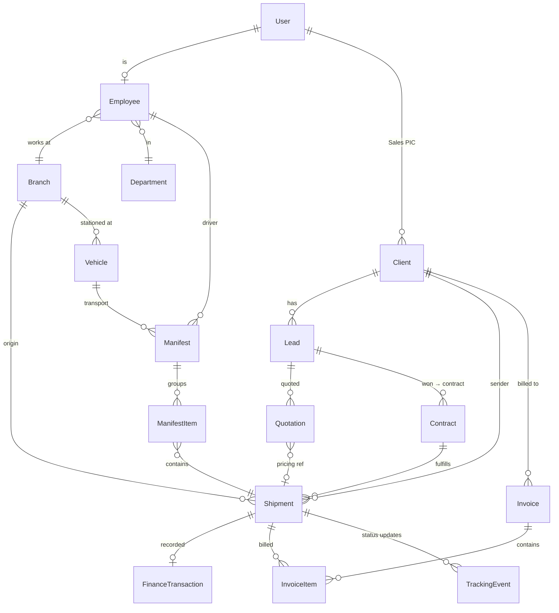

---

## 6. Sistem Role & Permission

### 6.1 Daftar Role

| Role | Kode | Department | Level |
|------|------|------------|-------|
| **Super Admin** | `SUPER_ADMIN` | IT | Tertinggi — akses semua |
| **Direktur** | `DIRECTOR` | Manajemen | Lihat semua data semua cabang |
| **Kepala Cabang** | `BRANCH_HEAD` | Cabang | Kelola semua data di cabangnya |
| **Supervisor Sales** | `SALES_SUPERVISOR` | Sales | Kelola semua sales & CRM di cabangnya |
| **Sales** | `SALES` | Sales | Hanya data CRM milik sendiri |
| **Manager Operasional** | `OPS_MANAGER` | Operasional | Kelola semua operasional di cabangnya |
| **Staff Operasional** | `OPS_STAFF` | Operasional | Input shipment, manifest, tracking |
| **Driver** | `DRIVER` | Operasional | Update tracking & POD dari mobile/web |
| **Manager Finance** | `FINANCE_MANAGER` | Finance | Kelola semua data finance |
| **Staff Finance** | `FINANCE_STAFF` | Finance | Input transaksi, invoice |
| **Finance Viewer** | `FINANCE_VIEWER` | Finance | Lihat data finance (read-only) |
| **HRGA Manager** | `HRGA_MANAGER` | HRGA | Kelola semua HR + approval level 2 |
| **HRGA Staff** | `HRGA_STAFF` | HRGA | Input data HR |

### 6.2 Matriks Permission per Modul

| Modul / Fitur | Super Admin | Direktur | Kepala Cabang | Sales Supervisor | Sales | Ops Manager | Ops Staff | Driver | Finance Manager | Finance Staff | HRGA Manager | HRGA Staff |
|--------------|:-----------:|:--------:|:-------------:|:----------------:|:-----:|:-----------:|:---------:|:------:|:---------------:|:-------------:|:------------:|:----------:|
| **Dashboard Global** | ✅ | ✅ | 🏢 | — | — | — | — | — | — | — | — | — |
| **Dashboard CRM** | ✅ | ✅ | 🏢 | ✅ | 👤 | — | — | — | — | — | — | — |
| **Dashboard Ops** | ✅ | ✅ | 🏢 | — | — | 🏢 | — | — | — | — | — | — |
| **Dashboard Finance** | ✅ | ✅ | — | — | — | — | — | — | ✅ | — | — | — |
| **Dashboard HR** | ✅ | ✅ | 🏢 | — | — | — | — | — | — | — | ✅ | — |
| | | | | | | | | | | | | |
| **Client** (CRUD) | ✅ | 👁️ | 🏢 | ✅ | 👤 | — | — | — | — | — | — | — |
| **Lead** (CRUD) | ✅ | 👁️ | 🏢 | ✅ | 👤 | — | — | — | — | — | — | — |
| **Contract** (CRUD) | ✅ | 👁️ | 🏢 | ✅ | 👤 | — | — | — | — | — | — | — |
| **Quotation** (CRUD) | ✅ | 👁️ | 🏢 | ✅ | 👤 | — | — | — | — | — | — | — |
| **Activity** (CRUD) | ✅ | 👁️ | 🏢 | ✅ | 👤 | — | — | — | — | — | — | — |
| | | | | | | | | | | | | |
| **Shipment** (Create) | ✅ | — | 🏢 | — | — | 🏢 | ✅ | — | — | — | — | — |
| **Shipment** (View) | ✅ | ✅ | 🏢 | 🏢 | 👤 | 🏢 | 🏢 | 🏢 | ✅ | ✅ | — | — |
| **Manifest** (CRUD) | ✅ | — | 🏢 | — | — | 🏢 | ✅ | — | — | — | — | — |
| **Tracking** (Update) | ✅ | — | 🏢 | — | — | 🏢 | ✅ | ✅ | — | — | — | — |
| **Fleet/Vehicle** | ✅ | 👁️ | 🏢 | — | — | 🏢 | 👁️ | — | — | — | — | — |
| | | | | | | | | | | | | |
| **Finance Transaction** | ✅ | 👁️ | — | — | — | — | — | — | ✅ | ✅ | — | — |
| **Invoice** (CRUD) | ✅ | — | — | — | — | — | — | — | ✅ | ✅ | — | — |
| **Payment** (Record) | ✅ | — | — | — | — | — | — | — | ✅ | ✅ | — | — |
| **Finance Report** | ✅ | ✅ | — | — | — | — | — | — | ✅ | 👁️ | — | — |
| **Column Permission** | ✅ | — | — | — | — | — | — | — | ✅ | ⚙️ | — | — |
| | | | | | | | | | | | | |
| **Employee** (CRUD) | ✅ | 👁️ | 🏢 | — | — | — | — | — | — | — | ✅ | ✅ |
| **Attendance** (View) | ✅ | 👁️ | 🏢 | — | — | — | — | — | — | — | ✅ | ✅ |
| **Attendance** (Input) | — | — | — | — | — | — | — | — | — | — | — | — |
| **Leave** (Request) | — | — | — | — | — | — | — | — | — | — | — | — |
| **Leave** (Approve L1) | — | — | — | — | — | — | — | — | — | — | — | — |
| **Leave** (Approve L2) | ✅ | — | — | — | — | — | — | — | — | — | ✅ | — |
| **Document** (CRUD) | ✅ | — | 🏢 | — | — | — | — | — | — | — | ✅ | ✅ |
| | | | | | | | | | | | | |
| **Branch** (Manage) | ✅ | — | — | — | — | — | — | — | — | — | — | — |
| **Role** (Manage) | ✅ | — | — | — | — | — | — | — | — | — | — | — |
| **User** (Manage) | ✅ | — | — | — | — | — | — | — | — | — | — | — |
| **Audit Log** | ✅ | ✅ | — | — | — | — | — | — | — | — | — | — |

> **Legenda:**
> - ✅ = Full Access (semua cabang)
> - 🏢 = Hanya data di cabang sendiri
> - 👤 = Hanya data milik sendiri
> - 👁️ = Read-only
> - ⚙️ = Sesuai column permission yang diberikan
> - — = Tidak ada akses

### 6.3 Catatan Khusus Attendance & Leave

| Aksi | Siapa | Keterangan |
|------|-------|------------|
| Absensi (Check-in/out) | **Semua karyawan** via mobile | Siapapun yang punya akun bisa absen |
| Request cuti | **Semua karyawan** | Melalui web atau mobile |
| Approve cuti Level 1 | **Supervisor langsung** (dari `Employee.supervisor`) | Otomatis berdasarkan hierarki |
| Approve cuti Level 2 | **HRGA Manager** | Final approval |

### 6.4 Implementasi Teknis Permission

```python
# Model Role (diperluas dari HR-Paketin)
class Role(models.Model):
    id = models.UUIDField(primary_key=True, default=uuid.uuid4)
    name = models.CharField(max_length=100, unique=True)  # e.g. "SALES", "OPS_STAFF"
    display_name = models.CharField(max_length=100)        # e.g. "Staff Sales"
    department = models.CharField(max_length=50)            # e.g. "SALES", "OPS", "FINANCE", "HRGA"
    level = models.IntegerField(default=0)                  # 0=staff, 1=supervisor, 2=manager, 3=director, 4=admin
    
    # Module access flags
    can_access_crm = models.BooleanField(default=False)
    can_access_operations = models.BooleanField(default=False)
    can_access_finance = models.BooleanField(default=False)
    can_access_hr = models.BooleanField(default=False)
    can_access_admin = models.BooleanField(default=False)
    
    description = models.TextField(blank=True)
```

---

## 7. Konfigurasi Branch/Cabang

### 7.1 Model Branch (Unified)

Menggabungkan `core.Branch` dari CRM dan `organizations.Branch` dari HR:

```python
class Branch(models.Model):
    id = models.UUIDField(primary_key=True, default=uuid.uuid4)
    
    # Identitas
    name = models.CharField('Nama Cabang', max_length=255)
    code = models.CharField('Kode Cabang', max_length=50, unique=True)  # e.g. "JKT", "SBY"
    
    # Lokasi
    city = models.CharField('Kota', max_length=100)
    province = models.CharField('Provinsi', max_length=100)
    address = models.TextField('Alamat')
    phone = models.CharField('Telepon', max_length=30, blank=True)
    
    # GPS (dari HR-Paketin, untuk absensi)
    latitude = models.DecimalField(max_digits=9, decimal_places=6, null=True, blank=True)
    longitude = models.DecimalField(max_digits=9, decimal_places=6, null=True, blank=True)
    timezone = models.CharField(max_length=50, default='Asia/Jakarta')
    
    # Konfigurasi Absensi (dari HR-Paketin)
    attendance_radius_meters = models.IntegerField(default=200)
    clock_in_time = models.TimeField(default='08:00:00')
    clock_out_time = models.TimeField(default='17:00:00')
    
    # Konfigurasi Operasional
    is_warehouse = models.BooleanField('Punya Gudang?', default=False)
    warehouse_capacity_cbm = models.DecimalField('Kapasitas Gudang (m³)', max_digits=10, decimal_places=2, null=True, blank=True)
    
    # Status
    is_active = models.BooleanField('Aktif', default=True)
    is_head_office = models.BooleanField('Head Office?', default=False)
    
    created_at = models.DateTimeField(auto_now_add=True)
    updated_at = models.DateTimeField(auto_now=True)
```

### 7.2 Data Isolation per Branch

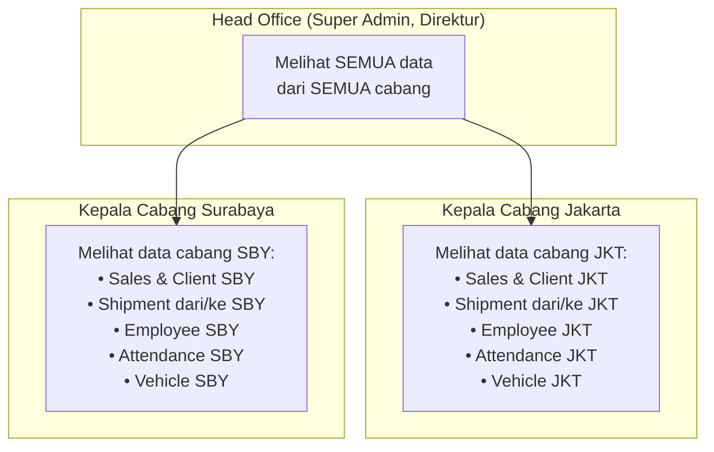

### 7.3 Branch Filtering Logic

| Modul | Filter Branch | Field |
|-------|---------------|-------|
| Client | Client ditugaskan ke branch via Sales PIC | `client.owner.employee_profile.branch` |
| Lead | Mengikuti client | Via `lead.client.owner.employee_profile.branch` |
| Shipment | Branch asal | `shipment.branch_origin` |
| Manifest | Branch keberangkatan | `manifest.branch` |
| Vehicle | Branch stasioner | `vehicle.branch` |
| Employee | Branch karyawan | `employee.branch` |
| Attendance | Branch karyawan | `event.employee.branch` |
| Finance | Per sheet/file (admin assign) | `sheet.branch` (field baru) |

---

## 8. Mobile App (Khusus Absensi)

### 8.1 Scope

| Fitur | Status | Keterangan |
|-------|--------|------------|
| Login (JWT) | ✅ Existing | Login via email |
| Register device | ✅ Existing | Fingerprint device |
| Face enrollment | ✅ Existing | Simpan face embedding |
| Check-in (GPS + Face) | ✅ Existing | Validasi lokasi & wajah |
| Check-out (GPS + Face) | ✅ Existing | Validasi lokasi & wajah |
| Riwayat absensi | ✅ Existing | Lihat history sendiri |
| Request cuti | ✅ Existing | Form pengajuan cuti |
| Notifikasi | ✅ Existing | Push notification |
| ~~CRM~~ | ❌ | Tidak di mobile |
| ~~Operations~~ | ❌ | Tidak di mobile |
| ~~Finance~~ | ❌ | Tidak di mobile |

### 8.2 Perubahan Mobile

Hanya perlu mengganti **base URL API** dari `hr-paketin` ke `erp-paketin`. Endpoint dan response format tetap sama karena kita akan mempertahankan struktur API attendance.

---

## 9. Rencana Migrasi (Fase Eksekusi)

### Fase 0: Persiapan (1-2 hari)
- [ ] Buat project `erp-paketin` baru dengan `django-admin startproject`
- [ ] Setup database MySQL `erp_paketin`
- [ ] Setup virtual environment & `requirements.txt` (gabungan semua dependency)
- [ ] Setup `config/settings.py` dengan konfigurasi unified

### Fase 1: Core & Auth (2-3 hari)
- [ ] Buat `apps/accounts/` — Unified User model (UUID, email login)
- [ ] Buat `apps/organizations/` — Branch (gabungan CRM + HR), Department, Position
- [ ] Buat `apps/employees/` — Employee, RegisteredDevice, FaceProfile
- [ ] Buat Role model dengan module access flags
- [ ] Buat RBAC middleware & mixins (dari CRM `core/mixins.py`, diperluas)
- [ ] Test: Login, create user, assign role & branch

### Fase 2: CRM Module (2-3 hari)
- [ ] Migrasi `apps/crm/` — Client, Lead, Contract, Quotation, Activity, Reminder
- [ ] Modifikasi `owner` field dari `auth.User` FK menjadi UUID FK ke `accounts.User`
- [ ] Tambahkan branch filtering ke Client
- [ ] Migrasi template CRM (base.html → ERP base)
- [ ] Test: CRUD sales pipeline end-to-end

### Fase 3: HR Module (2-3 hari)
- [ ] Migrasi `apps/hr/attendance/` — AttendancePolicy, AttendanceEvent
- [ ] Migrasi `apps/hr/leave/` — LeaveType, LeaveBalance, LeaveRequest
- [ ] Migrasi `apps/hr/approvals/` — Approval engine
- [ ] Migrasi `apps/hr/documents/` — Document management
- [ ] Setup JWT endpoints untuk mobile
- [ ] Test: Absensi via API, request cuti, approval flow

### Fase 4: Operations Module — BARU (3-5 hari)
- [x] Buat `apps/operations/shipments/` — Shipment, ShipmentItem
- [x] Buat `apps/operations/manifests/` — Manifest, ManifestItem
- [x] Buat `apps/operations/tracking/` — TrackingEvent
- [ ] Buat `apps/operations/fleet/` — Vehicle, VehicleMaintenanceLog
- [ ] Hubungkan: Quotation → Shipment → Manifest → Tracking
- [x] Template UI untuk input resi, buat manifest, update tracking
- [ ] Test: Flow dari quotation hingga delivered

### Fase 5: Finance Module (2-3 hari)
- [ ] Migrasi `apps/finance/` — KpiFile, KpiSheet, KpiFinance (refactored)
- [ ] Buat Vendor model terpisah (dari string → FK)
- [ ] Buat Invoice & PaymentRecord models
- [ ] Hubungkan: Shipment → FinanceTransaction (otomatis)
- [ ] Hubungkan: Shipment → Invoice (auto-generate)
- [ ] Migrasi SPA finance (Vite) sebagai embedded view
- [ ] Test: Auto-create finance row saat shipment delivered

### Fase 6: Notifications, Audit & Dashboard### 10.3 Component Guidelines
- Use unified forms with `crispy_forms` layout.
- Map Integration: Leaflet.js locked to Indonesia bounds for dashboard. Ensure it syncs with `Branch` master data.

---

## 11. Fase Refinement & Additional Requests (Agustus 2026)

Berdasarkan permintaan terbaru, berikut adalah item yang ditambahkan ke dalam master plan untuk dieksekusi:

1. **Master Data CRUD Frontend**: 
   - Membuka fitur *Create, Read, Update, Delete* (CRUD) secara langsung di antarmuka ERP (di luar Django Admin) untuk seluruh Master Data, termasuk model **Vehicle / Kendaraan**, sehingga admin bisa input manual.
2. **Penggabungan Role User**: 
   - Menggabungkan entitas `Driver` dan `Sales` ke dalam model `User` tunggal yang dilengkapi dengan *role/category* sehingga bisa difilter di master data pengguna.
3. **Integrasi Peta (Map) dengan Master Data**: 
   - Menghubungkan grafik Peta di Dashboard Utama langsung dengan tabel `Branch` (Cabang) dan `Shipment` dari database agar otomatis menyesuaikan (dinamis) setiap ada penambahan cabang baru. 
4. **Grafik Klien Pagination**: 
   - Menambahkan fitur geser (Next/Prev) pada grafik *Top 5 Klien Pengirim / Destinasi* di Dashboard Utama agar bisa melihat daftar ke-6, ke-7, dan seterusnya.
5. **Global Dashboard Filter**: 
   - Mengubah tombol filter dashboard (yang tadinya hanya "Berdasarkan Sales") menjadi "Kategori Filter" (Sales, Driver, Admin) agar dapat mengakomodasi semua modul (HR, Ops, Finance).
6. **Perbaikan Logika Kehadiran (HR)**: 
   - Memastikan widget Kehadiran (Absensi) di dashboard me-reset metrik `hr_present` dan `hr_absent` setiap harinya secara *real-time*, ditambah dengan penanda *Tanggal Hari Ini*.
7. **Permission Superadmin (Finance)**: 
   - Memberikan hak penuh kepada *Superadmin* untuk dapat menghapus data di modul Invoice & Billing. 
   - Menerapkan konsep *Otomatis Draft*: Saat resi (waybill) berstatus *Delivered*, sistem akan membuat *Invoice Draft* secara otomatis tanpa langsung di-publish (memberi fleksibilitas ke Finance).
8. **UI/UX Cleanup**: 
   - Menghilangkan duplikasi Navbar pada modul Finance (Worksheet, Rekap, dll) karena ERP sudah memiliki menu navigasi utama (Sidebar). per role (Admin global, Sales CRM, Ops realtime, Finance P&L, HR attendance)
- [ ] Test: Notifikasi cross-module

### Fase 7: Mobile Migration (1-2 hari)
- [ ] Update Flutter app base URL ke ERP backend
- [ ] Test semua endpoint attendance di ERP
- [ ] Verify face verification & device binding

### Fase 8: Data Migration & UAT (2-3 hari)
- [ ] Script migrasi data dari 3 database existing → `erp_paketin`
- [ ] User Acceptance Testing
- [ ] Fix bugs
- [ ] Deploy ke production

---

> **Estimasi Total: 15-25 hari kerja**

> [!IMPORTANT]
> Fase 4 (Operations) adalah modul yang benar-benar baru dan menjadi **inti dari ERP logistik**. Ini yang menjembatani alur dari Sales → Pengiriman → Finance. Tanpa modul ini, ketiga sistem tetap terpisah secara fungsional.

> [!TIP]
> Karena ketiga project sudah menggunakan Django + MySQL, migrasi data seharusnya relatif straightforward menggunakan script `manage.py` custom command yang membaca dari database lama dan insert ke database baru.

---

## 10. UI/UX Design System

> **Prinsip Utama:** Desain mengikuti pola CRM-Paketin yang sudah ada (sidebar kiri gelap + topbar putih + content area abu-abu muda), dengan adaptasi per modul sesuai kebutuhan masing-masing — terutama modul Finance yang memiliki fitur worksheet/spreadsheet SPA.

### 10.1 Design Tokens (CSS Variables)

Semua CSS variables yang ada di CRM-Paketin akan dijadikan fondasi dan diperluas:

```css
:root {
    /* ─── Brand Colors ─── */
    --pk-red: #e32020;              /* Primary brand */
    --pk-red-dark: #cc1818;          /* Hover/active */
    --pk-red-light: #fce8e8;         /* Subtle background */

    /* ─── Module Accent Colors (BARU) ─── */
    --pk-crm-accent: #e32020;        /* Merah — CRM/Sales */
    --pk-ops-accent: #f97316;        /* Oranye — Operasional */
    --pk-fin-accent: #2563eb;        /* Biru — Finance */
    --pk-hr-accent: #7c3aed;         /* Ungu — HRGA */
    --pk-admin-accent: #475569;      /* Slate — Admin */

    /* ─── Neutral Colors (dari CRM-Paketin) ─── */
    --pk-white: #ffffff;
    --pk-gray-50: #f8f9fa;
    --pk-gray-100: #f1f3f5;
    --pk-gray-200: #e9ecef;
    --pk-gray-300: #dee2e6;
    --pk-gray-500: #adb5bd;
    --pk-gray-700: #495057;
    --pk-gray-900: #212529;

    /* ─── Layout ─── */
    --pk-sidebar-width: 260px;
    --pk-sidebar-collapsed-width: 72px;
    --pk-navbar-height: 64px;

    /* ─── Typography ─── */
    --pk-font-family: 'Inter', -apple-system, BlinkMacSystemFont, 'Segoe UI', sans-serif;
    --pk-font-size-xs: 0.68rem;      /* Sidebar section title */
    --pk-font-size-sm: 0.78rem;      /* Table headers, labels */
    --pk-font-size-base: 0.9rem;     /* Body text */
    --pk-font-size-lg: 1.15rem;      /* Page title */
    --pk-font-size-xl: 1.5rem;       /* KPI values */

    /* ─── Spacing ─── */
    --pk-space-xs: 4px;
    --pk-space-sm: 8px;
    --pk-space-md: 16px;
    --pk-space-lg: 24px;
    --pk-space-xl: 32px;

    /* ─── Animation ─── */
    --pk-transition: all 0.3s cubic-bezier(0.4, 0, 0.2, 1);

    /* ─── Border Radius ─── */
    --pk-radius-sm: 6px;
    --pk-radius-md: 8px;
    --pk-radius-lg: 12px;
    --pk-radius-xl: 16px;
    --pk-radius-pill: 20px;

    /* ─── Shadows ─── */
    --pk-shadow-sm: 0 1px 3px rgba(0,0,0,0.04);
    --pk-shadow-md: 0 4px 12px rgba(0,0,0,0.08);
    --pk-shadow-lg: 0 20px 60px rgba(0,0,0,0.3);
}
```

### 10.2 Tech Stack UI

| Aspek | Teknologi | Keterangan |
|-------|-----------|------------|
| **CSS Framework** | Bootstrap 5.3.3 | Sama seperti ketiga project existing |
| **Icon Library** | Phosphor Icons (Duotone) | `@phosphor-icons/web` — sudah dipakai di CRM + HR + Finance |
| **Typography** | Google Fonts: Inter | Weight: 300–800, sudah dipakai ketiga project |
| **Form Enhancement** | Crispy Forms + Bootstrap 5 | Dari CRM-Paketin |
| **Select Enhancement** | Select2 + Bootstrap 5 Theme | Dari CRM-Paketin |
| **Charts** | Chart.js 4.x | Dari CRM-Paketin |
| **Finance SPA** | Vite + Vanilla JS | Khusus halaman worksheet/spreadsheet |
| **Template Engine** | Django Templates (SSR) | Semua halaman kecuali Finance worksheet |

### 10.3 Layout Utama

Layout mengikuti pola CRM-Paketin yang sudah ada dengan tiga area utama:

```
┌──────────────────────────────────────────────────────────┐
│                    FIXED SIDEBAR (260px)                  │
│  ┌─────────┐  ┌────────────────────────────────────────┐ │
│  │         │  │  STICKY TOP NAVBAR (64px)               │ │
│  │  LOGO   │  │  [☰] Page Title            🔍 🔔 👤    │ │
│  │         │  ├────────────────────────────────────────┤ │
│  ├─────────┤  │                                        │ │
│  │ SECTION │  │                                        │ │
│  │ ─ Link  │  │         CONTENT AREA                   │ │
│  │ ─ Link  │  │         (scrollable)                   │ │
│  │ ─ Link  │  │                                        │ │
│  │         │  │  ┌──────────────────────────────────┐  │ │
│  │ SECTION │  │  │  KPI Cards Row                   │  │ │
│  │ ─ Link  │  │  └──────────────────────────────────┘  │ │
│  │ ─ Link  │  │  ┌──────────────────────────────────┐  │ │
│  │         │  │  │  Data Table / Charts / Forms      │  │ │
│  │ SECTION │  │  │                                    │  │ │
│  │ ─ Link  │  │  └──────────────────────────────────┘  │ │
│  │         │  │                                        │ │
│  └─────────┘  └────────────────────────────────────────┘ │
└──────────────────────────────────────────────────────────┘
```

**Detail Layout (identik dengan CRM-Paketin):**
- **Sidebar**: `position: fixed`, `width: 260px`, gradient `#1a1a2e → #16213e → #0f3460` (dark blue), collapsible (mobile: slide-in overlay)
- **Top Navbar**: `position: sticky`, `height: 64px`, putih, border bawah, berisi: hamburger toggle, judul halaman, search (Ctrl+K), notifikasi bell, who's online, user dropdown
- **Content Area**: `background: #f8f9fa`, padding `24px`, scrollable

### 10.4 Sidebar — Dinamis per Role

Sidebar menampilkan menu berdasarkan module access yang dimiliki role user. Menu dikelompokkan dalam section titles:

```
┌────────────────────────┐
│     🔴 PAKETIN LOGO    │
├────────────────────────┤
│  📊 Dasbor             │  ← Selalu tampil
│                        │
│  ── CRM ──────────     │  ← Hanya jika can_access_crm
│  🏢 Klien              │
│  🎯 Peluang (Lead)     │
│  🤝 Kontrak            │
│  📄 Penawaran          │
│  📖 Aktivitas          │
│  🔔 Reminder           │
│                        │
│  ── OPERASIONAL ──     │  ← Hanya jika can_access_operations
│  📦 Resi / Pengiriman  │
│  📋 Manifest           │
│  🚚 Tracking           │
│  🚛 Armada             │
│                        │
│  ── FINANCE ────       │  ← Hanya jika can_access_finance
│  📂 Workbook Tahunan   │
│  📊 Worksheet          │
│  🧾 Invoice            │
│  💳 Pembayaran         │
│  📈 Laporan Keuangan   │
│                        │
│  ── HRGA ──────        │  ← Hanya jika can_access_hr
│  🏢 Cabang & Jabatan   │
│  👥 Data Pegawai       │
│  📅 Riwayat Absensi    │
│  ✈️  Pengajuan Cuti     │
│  📁 Dokumen HR         │
│  ⚙️  Kebijakan Absensi  │
│                        │
│  ── LAPORAN ────       │
│  🖨️ Laporan Bulanan    │
│                        │
│  ── ADMIN ──────       │  ← Hanya admin/superuser
│  🕐 Audit Log          │
│  ⚙️  Django Admin       │
└────────────────────────┘
```

**Implementasi Teknis:**
```python
# Context processor: core/context_processors.py
def sidebar_modules(request):
    user = request.user
    if not user.is_authenticated:
        return {}
    
    employee = getattr(user, 'employee_profile', None)
    roles = user.roles.all() if hasattr(user, 'roles') else []
    
    return {
        'show_crm': user.is_superuser or any(r.can_access_crm for r in roles),
        'show_operations': user.is_superuser or any(r.can_access_operations for r in roles),
        'show_finance': user.is_superuser or any(r.can_access_finance for r in roles),
        'show_hr': user.is_superuser or any(r.can_access_hr for r in roles),
        'show_admin': user.is_superuser or any(r.can_access_admin for r in roles),
    }
```

### 10.5 Module Accent Color System

Sidebar active link dan elemen halaman berubah warna sesuai modul yang sedang dibuka:

| Modul | Accent Color | Sidebar Active BG | Primary Button |
|-------|-------------|--------------------|---------|
| **CRM / Sales** | `#e32020` (Merah) | `rgba(227,32,32, 0.15)` | `btn-danger` |
| **Operasional** | `#f97316` (Oranye) | `rgba(249,115,22, 0.15)` | `btn-warning` |
| **Finance** | `#2563eb` (Biru) | `rgba(37,99,235, 0.15)` | `btn-primary` |
| **HRGA** | `#7c3aed` (Ungu) | `rgba(124,58,237, 0.15)` | `btn-purple` (custom) |
| **Admin** | `#475569` (Slate) | `rgba(71,85,105, 0.15)` | `btn-secondary` |

```css
/* Sidebar active link berubah warna per modul */
.sidebar-link.active[data-module="crm"] {
    background: rgba(227,32,32, 0.15);
    border-left-color: var(--pk-crm-accent);
}
.sidebar-link.active[data-module="ops"] {
    background: rgba(249,115,22, 0.15);
    border-left-color: var(--pk-ops-accent);
}
.sidebar-link.active[data-module="finance"] {
    background: rgba(37,99,235, 0.15);
    border-left-color: var(--pk-fin-accent);
}
.sidebar-link.active[data-module="hr"] {
    background: rgba(124,58,237, 0.15);
    border-left-color: var(--pk-hr-accent);
}
```

### 10.6 Komponen UI Reusable

Semua komponen berikut sudah ada di CRM-Paketin dan akan dipakai ulang:

#### 10.6.1 KPI Card

Digunakan di setiap dashboard modul:

```
┌─────────────────────────────┐
│  ┌──────┐                   │
│  │ ICON │  1,234            │  ← kpi-value (1.5rem, 800 weight)
│  │      │  TOTAL KLIEN      │  ← kpi-label (0.8rem, uppercase)
│  └──────┘                   │
└─────────────────────────────┘
```
- `border-radius: 12px`, `border: 1px solid #e9ecef`
- Hover: `translateY(-2px)`, `box-shadow: 0 4px 12px rgba(0,0,0,0.08)`
- Icon box: `52x52px`, `border-radius: 12px`, colored background (misal `bg-primary-subtle`)

#### 10.6.2 Data Table

Digunakan untuk semua list view (Client, Lead, Shipment, Invoice, Employee, dll):

```
┌─────────────────────────────────────────────────┐
│  Card Header: Judul + [+ Tambah] button         │
├─────────────────────────────────────────────────┤
│  NAMA    │ STATUS │ TANGGAL │ AKSI              │  ← thead (bg: #f8f9fa, uppercase 0.78rem)
├──────────┼────────┼─────────┼───────────────────┤
│  Data 1  │ ●Baru  │ 19 Agu  │ 👁 ✏️ 🗑         │  ← tbody (0.9rem)
│  Data 2  │ ●Aktif │ 18 Agu  │ 👁 ✏️ 🗑         │  ← hover: rgba(accent, 0.03)
├──────────┴────────┴─────────┴───────────────────┤
│  ← 1 2 3 ... 10 →  (pagination)                │
└─────────────────────────────────────────────────┘
```

#### 10.6.3 Status Badge

Pill-shaped badges (`border-radius: 20px`, `0.75rem`, `font-weight: 600`):

| Konteks | Warna | Class |
|---------|-------|-------|
| Baru / Draft | Abu-abu `#e9ecef` / `#495057` | `status-new` |
| In Progress / Dihubungi | Biru `#cfe2ff` / `#0a58ca` | `status-contacted` |
| Menunggu / Pending | Kuning `#fff3cd` / `#856404` | `status-proposal` |
| Berhasil / Won / Delivered | Hijau `#d1e7dd` / `#0f5132` | `status-won` |
| Gagal / Rejected / Lost | Merah `#f8d7da` / `#842029` | `status-lost` |
| Transit / Negosiasi | Oranye `#ffe5d0` / `#984c0c` | `status-negotiation` |

#### 10.6.4 Form Layout

Mengikuti CRM-Paketin (Crispy Forms Bootstrap 5):
- Card wrapper dengan header judul
- Form fields di dalam card body
- Focus state: `border-color: var(--pk-red)`, `box-shadow: 0 0 0 0.2rem rgba(accent, 0.25)`
- Submit button: full accent color, `border-radius: 8px`
- Currency fields auto-format ke format Rupiah (titik ribuan)

#### 10.6.5 Detail View (Split Card)

Digunakan untuk detail Client, Lead, Shipment, dll:

```
┌──────────────────────────────────────────────┐
│  ← Kembali           [Edit] [Hapus]          │
├──────────────────────────────────────────────┤
│  ┌──────────────┐  ┌──────────────────────┐  │
│  │ Info Card     │  │ Related Data          │  │
│  │  Nama: ...    │  │  Tab 1 | Tab 2 | Tab3 │  │
│  │  Status: ...  │  │  ┌──────────────────┐ │  │
│  │  Cabang: ...  │  │  │  Table/List      │ │  │
│  └──────────────┘  │  └──────────────────┘ │  │
│                     └──────────────────────┘  │
└──────────────────────────────────────────────┘
```

#### 10.6.6 Alert / Toast Notification

Mengikuti CRM-Paketin:
- `border-radius: 10px`, `border: none`, `font-weight: 500`
- Icon prefix: ✅ success, ⚠️ warning, ❌ danger, ℹ️ info
- Auto-dismiss dengan `alert-dismissible fade show`

#### 10.6.7 Global Search Modal (Ctrl+K)

Dari CRM-Paketin, diperluas untuk semua modul:

```
┌──────────────────────────────────────┐
│  🔍 Cari klien, resi, invoice...     │
├──────────────────────────────────────┤
│  📊 CRM                              │
│    → PT Amanah Logistik (Client)     │
│    → LD-0042 (Lead)                  │
│  🚛 OPERASIONAL                      │
│    → WB-20260819-001 (Shipment)      │
│  💰 FINANCE                          │
│    → INV-202608-0012 (Invoice)       │
│  👥 HR                               │
│    → Budi Santoso (Employee)         │
└──────────────────────────────────────┘
```

### 10.7 Spesifikasi UI per Modul

#### 10.7.1 Modul CRM — Server-Side Rendering (Django Templates)

**Rendering:** Django Templates (SSR) — sama persis seperti CRM-Paketin existing.

**Halaman-halaman:**

| Halaman | Tipe Layout | Komponen Utama |
|---------|-------------|----------------|
| Dashboard CRM | KPI + Charts | 4 KPI cards (Klien, Lead, Won, Value) + Pipeline chart + Recent activities |
| Client List | Data Table | Table + Filter (sales, status, kategori) + Search |
| Client Detail | Split Card | Info kiri + Tabs (Lead, Kontrak, Activity) kanan |
| Client Form | Form | Crispy form, Select2 untuk industry & group |
| Lead List | Data Table | Table + Status filter + Pipeline Kanban toggle |
| Lead Detail | Split Card | Info + Shipping detail + Response metrics + Activity timeline |
| Quotation List | Data Table | Table + Status badges + Attachment indicators |
| Quotation Detail | Split Card | Kalkulasi volumetrik + Multi-item table |
| Contract List | Data Table | Table + Expiry warning badges |
| Activity List | Timeline | Activity type badges + Log entries |
| Reminder List | Card List | Reminder cards with due date |

**Wireframe Dashboard CRM:**
```
┌──────────────────────────────────────────────────────────┐
│  [Filter ▾]                                              │
├──────────────────────────────────────────────────────────┤
│  ┌──────────┐ ┌──────────┐ ┌──────────┐ ┌──────────┐   │
│  │ 👥 128    │ │ 🎯 45    │ │ ✅ 12    │ │ 💰 2.4M  │   │
│  │ Klien    │ │ Peluang  │ │ Won      │ │ Pipeline │   │
│  └──────────┘ └──────────┘ └──────────┘ └──────────┘   │
│                                                          │
│  ┌─────────────────────────┐ ┌────────────────────────┐ │
│  │  📊 Pipeline Chart       │ │  📅 Aktivitas Terbaru  │ │
│  │  (Bar chart per status)  │ │  • Call - PT Maju      │ │
│  │                          │ │  • Visit - PT Jaya     │ │
│  │                          │ │  • WA - CV Sukses      │ │
│  └─────────────────────────┘ └────────────────────────┘ │
│                                                          │
│  ┌─────────────────────────┐ ┌────────────────────────┐ │
│  │  📈 Closing Rate Chart   │ │  ⏰ Reminder Hari Ini  │ │
│  │  (Line chart)            │ │  • Follow-up PT ABC    │ │
│  └─────────────────────────┘ └────────────────────────┘ │
└──────────────────────────────────────────────────────────┘
```

#### 10.7.2 Modul Operasional — Server-Side Rendering (Django Templates)

**Rendering:** Django Templates (SSR) — mengikuti pola CRM-Paketin.

**Accent color:** Oranye (`#f97316`)

| Halaman | Tipe Layout | Komponen Utama |
|---------|-------------|----------------|
| Dashboard Ops | KPI + Live Feed | KPI cards (Pending, Transit, Delivered hari ini) + Live tracking feed |
| Shipment List | Data Table | Table + Filter (status, cabang, tanggal) + Quick search AWB |
| Shipment Create | Multi-step Form | Step 1: Pilih Client/Contract → Step 2: Barang → Step 3: Review |
| Shipment Detail | Split Card | Info pengiriman kiri + Tracking timeline kanan |
| Manifest List | Data Table | Table + Status filter |
| Manifest Create | Form + Checklist | Pilih shipments → assign vehicle/driver → review |
| Tracking Update | Simple Form | Status dropdown + lokasi + foto POD upload |
| Fleet List | Card Grid | Vehicle cards (foto, plat, status, next maintenance) |

**Wireframe Dashboard Operasional:**
```
┌──────────────────────────────────────────────────────────┐
│  ┌──────────┐ ┌──────────┐ ┌──────────┐ ┌──────────┐   │
│  │ 📥 15     │ │ 🚚 8     │ │ ✅ 23    │ │ ⚠️ 2     │   │
│  │ Pickup   │ │ Transit  │ │ Delivered│ │ Problem  │   │
│  │ Today    │ │ Now      │ │ Today    │ │ Shipment │   │
│  └──────────┘ └──────────┘ └──────────┘ └──────────┘   │
│                                                          │
│  ┌─────────────────────────────────────────────────────┐ │
│  │  🔴 LIVE TRACKING FEED                              │ │
│  │  ──────────────────────────────────────────────      │ │
│  │  12:45  WB-001  ✅ Delivered di Surabaya             │ │
│  │  12:30  WB-015  🚚 Transit → Semarang               │ │
│  │  12:15  WB-022  📥 Pickup dari PT Maju Jakarta      │ │
│  │  11:50  WB-008  🚚 Transit → Bandung                │ │
│  └─────────────────────────────────────────────────────┘ │
│                                                          │
│  ┌─────────────────────────┐ ┌────────────────────────┐ │
│  │  📋 Manifest Hari Ini    │ │  🚛 Status Armada      │ │
│  │  MF-001: JKT→SBY (8)    │ │  • B 1234 CD: Transit  │ │
│  │  MF-002: JKT→BDG (5)    │ │  • B 5678 EF: Ready    │ │
│  └─────────────────────────┘ └────────────────────────┘ │
└──────────────────────────────────────────────────────────┘
```

#### 10.7.3 Modul Finance — Hybrid (SSR + SPA Worksheet)

> [!IMPORTANT]
> Modul Finance memiliki **dua mode rendering** yang berbeda:
> 1. **Halaman reguler** (Dashboard, Invoice, Payment) → Django Templates (SSR) mengikuti design system CRM-Paketin
> 2. **Halaman Worksheet/Spreadsheet** → Vite SPA (Single Page Application) yang di-embed dalam shell Django — ini sudah ada di System-Finance dan akan dimigrasikan

**Accent color:** Biru (`#2563eb`)

##### Halaman SSR (Django Templates)

| Halaman | Tipe Layout | Komponen Utama |
|---------|-------------|----------------|
| Dashboard Finance | KPI + Charts | Revenue, Profit, Outstanding AR, AP + P&L chart |
| Invoice List | Data Table | Table + Status (Paid/Unpaid/Overdue) + Aging indicator |
| Invoice Detail | Split Card | Info invoice + Shipment items + Payment history |
| Invoice Create | Form | Client select → auto-populate shipments → review |
| Payment Record | Form | Invoice select → jumlah bayar → metode → bukti upload |
| Vendor List | Data Table | Vendor management |
| Laporan Keuangan | Report View | Filter periode + Export PDF/Excel |

##### Halaman SPA — Worksheet (dari System-Finance)

> Ini adalah fitur unik Finance yang membuat UI-nya berbeda dari modul lain. Halaman ini merender spreadsheet interaktif (seperti Google Sheets) menggunakan Vite + Vanilla JS.

**Komponen SPA yang sudah ada dari System-Finance:**

| File | Fungsi | Ukuran |
|------|--------|--------|
| `table.js` | Render grid spreadsheet, inline editing, keyboard nav | 214 KB |
| `toolbar.js` | Toolbar atas (format cell, styling, filter) | 102 KB |
| `recap.js` | Kalkulasi rekap bulanan/tahunan | 53 KB |
| `sheets.js` | Multi-sheet tabs (seperti Excel tabs) | 19 KB |
| `chart.js` | Visualisasi chart dari data sheet | 25 KB |
| `chat.js` | AI Chat assistant | 50 KB |
| `keyboard.js` | Keyboard shortcut handling | 7 KB |
| `selection.js` | Cell selection & multi-select | 8 KB |
| `monitoring.js` | Real-time monitoring | 23 KB |
| `spreadsheet.css` | Styling grid spreadsheet | 42 KB |

**Layout Worksheet (full-width, minimal padding):**
```
┌────────────────────────────────────────────────────────────┐
│  SIDEBAR (260px)  │  TOPBAR (Page Title: Worksheet)        │
│                   ├────────────────────────────────────────┤
│  ...              │  ┌──────────────────────────────────┐  │
│                   │  │  TOOLBAR (format, style, filter)  │  │
│                   │  ├──────────────────────────────────┤  │
│                   │  │  SPREADSHEET GRID (full width)    │  │
│                   │  │  ┌──┬──┬──┬──┬──┬──┬──┬──┬──┬──┐ │  │
│                   │  │  │A │B │C │D │E │F │G │H │I │J │ │  │
│                   │  │  ├──┼──┼──┼──┼──┼──┼──┼──┼──┼──┤ │  │
│                   │  │  │  │  │  │  │  │  │  │  │  │  │ │  │
│                   │  │  │  │  │  │  │  │  │  │  │  │  │ │  │
│                   │  │  │  │  │  │  │  │  │  │  │  │  │ │  │
│                   │  │  │  │  │  │  │  │  │  │  │  │  │ │  │
│                   │  │  └──┴──┴──┴──┴──┴──┴──┴──┴──┴──┘ │  │
│                   │  ├──────────────────────────────────┤  │
│                   │  │  [Sheet1] [Sheet2] [Recap] [+]    │  │
│                   │  └──────────────────────────────────┘  │
└────────────────────────────────────────────────────────────┘
```

**Perbedaan kunci Worksheet vs halaman biasa:**

| Aspek | Halaman Biasa (SSR) | Worksheet (SPA) |
|-------|---------------------|------------------|
| Rendering | Django Templates | Vite + JS |
| Content padding | `24px` | `0` (full bleed) |
| Scroll | Halaman scroll biasa | Grid internal scroll |
| Data loading | Server renders HTML | REST API (JSON) |
| Interactivity | Form submit | Inline cell edit |
| Toolbar | Tidak ada | Ada (format, filter, search) |
| Sheet tabs | Tidak ada | Ada (multi-sheet) |
| Cell styling | Tidak ada | Custom color, font, border |
| Formula | Tidak ada | Ada (kalkulasi otomatis) |
| Column permission | Tidak perlu | Per-kolom berdasarkan role |

**Integrasi SPA ke dalam Shell Django:**
```html
<!-- Template: finance/worksheet.html -->


    <link href="" rel="stylesheet">
    <link href="" rel="stylesheet">



    <!-- SPA mount point (full width, no container) -->
    <div id="finance-app" class="finance-worksheet-wrapper"></div>



    <script type="module" src=""></script>

```

```css
/* Override content padding untuk worksheet */
.finance-worksheet-wrapper {
    margin: -24px 0;  /* Hapus padding default page-content */
    height: calc(100vh - var(--pk-navbar-height));
    overflow: hidden;
}
```

#### 10.7.4 Modul HRGA — Server-Side Rendering (Django Templates)

**Rendering:** Django Templates (SSR) — mengikuti pola CRM-Paketin.

**Accent color:** Ungu (`#7c3aed`)

| Halaman | Tipe Layout | Komponen Utama |
|---------|-------------|----------------|
| Dashboard HR | KPI + Charts | Hadir/Telat/Alpha hari ini + Attendance chart + Leave pending |
| Branch & Dept | Accordion/Tree | Branch → Department → Position hierarchy |
| Employee List | Data Table | Table + Photo avatar + Filter (branch, dept, status) |
| Employee Detail | Profile Card | Foto + info + tabs (Attendance, Leave, Documents) |
| Attendance List | Data Table | Calendar view toggle + Table + Filter per cabang |
| Leave List | Data Table | Table + Status badges + Approve/Reject buttons inline |
| Leave Request | Form | Type select + Date picker + Reason + Attachment |
| Policy List | Card Grid | Policy cards per cabang |
| Document List | Data Table | Folder/category tree + Document list |

**Wireframe Dashboard HRGA:**
```
┌──────────────────────────────────────────────────────────┐
│  ┌──────────┐ ┌──────────┐ ┌──────────┐ ┌──────────┐   │
│  │ ✅ 45     │ │ ⏰ 3      │ │ ❌ 2     │ │ ✈️ 5     │   │
│  │ Hadir    │ │ Terlambat│ │ Alpha    │ │ Cuti     │   │
│  │ Hari Ini │ │ Hari Ini │ │ Hari Ini │ │ Pending  │   │
│  └──────────┘ └──────────┘ └──────────┘ └──────────┘   │
│                                                          │
│  ┌─────────────────────────────────────────────────────┐ │
│  │  📊 Grafik Kehadiran Mingguan                       │ │
│  │  (Stacked bar: Hadir / Telat / Alpha per hari)      │ │
│  └─────────────────────────────────────────────────────┘ │
│                                                          │
│  ┌─────────────────────────┐ ┌────────────────────────┐ │
│  │  ✈️ Cuti Menunggu Approval│ │  📄 Kontrak Akan Habis  │ │
│  │  • Budi - Annual Leave  │ │  • Ahmad - 15 hari lagi │ │
│  │    [Approve] [Reject]   │ │  • Siti - 30 hari lagi  │ │
│  └─────────────────────────┘ └────────────────────────┘ │
└──────────────────────────────────────────────────────────┘
```

#### 10.7.5 Dashboard Admin Global

Hanya untuk Super Admin dan Direktur. Menampilkan ringkasan cross-module:

```
┌──────────────────────────────────────────────────────────┐
│  🏢 RINGKASAN SELURUH CABANG                             │
│  [Jakarta ▾] [Surabaya ▾] [Semua ▾]                     │
├──────────────────────────────────────────────────────────┤
│  ── CRM ──────────         ── OPERASIONAL ──────────     │
│  ┌────────┐ ┌────────┐    ┌────────┐ ┌────────┐         │
│  │ 🎯 45   │ │ 💰 12  │    │ 📦 89  │ │ 🚚 15  │         │
│  │ Lead    │ │ Won    │    │ Kirim  │ │ Transit│         │
│  └────────┘ └────────┘    └────────┘ └────────┘         │
│                                                          │
│  ── FINANCE ──────────     ── HRGA ──────────            │
│  ┌────────┐ ┌────────┐    ┌────────┐ ┌────────┐         │
│  │ 💵 2.4B │ │ 📈 18% │    │ ✅ 95%  │ │ ✈️ 5   │         │
│  │ Revenue │ │ Profit │    │ Hadir  │ │ Cuti   │         │
│  └────────┘ └────────┘    └────────┘ └────────┘         │
│                                                          │
│  ┌─────────────────────────────────────────────────────┐ │
│  │  📊 Revenue vs Cost vs Profit (Line chart, 12 bulan) │ │
│  └─────────────────────────────────────────────────────┘ │
│                                                          │
│  ┌─────────────────────────┐ ┌────────────────────────┐ │
│  │  🏆 Top Sales Bulan Ini  │ │  🕐 Audit Log Terbaru  │ │
│  │  1. Ahmad - 15 closing  │ │  • Admin edit user     │ │
│  │  2. Budi  - 12 closing  │ │  • Finance add invoice │ │
│  └─────────────────────────┘ └────────────────────────┘ │
└──────────────────────────────────────────────────────────┘
```

### 10.8 Login Page

Mengikuti CRM-Paketin (login page yang sudah ada):

```
┌──────────────────────────────────────────────────┐
│                                                  │
│     background: gradient(#1a1a2e → #0f3460)      │
│                                                  │
│          ┌──────────────────────────┐            │
│          │                          │            │
│          │      🔴 PAKETIN LOGO     │            │
│          │      ERP Paketin Cargo   │            │
│          │                          │            │
│          │    ┌──────────────────┐   │            │
│          │    │  📧 Email         │   │            │
│          │    └──────────────────┘   │            │
│          │    ┌──────────────────┐   │            │
│          │    │  🔒 Password      │   │            │
│          │    └──────────────────┘   │            │
│          │                          │            │
│          │    [      LOGIN       ]   │            │
│          │    btn-danger, full-w     │            │
│          │                          │            │
│          │    © 2026 Paketin Cargo  │            │
│          └──────────────────────────┘            │
│           card: white, radius 16px,              │
│           shadow 0 20px 60px                     │
└──────────────────────────────────────────────────┘
```

### 10.9 Responsive Breakpoints

Mengikuti CRM-Paketin yang sudah ada:

| Breakpoint | Sidebar | Topbar | Content |
|------------|---------|--------|---------|
| **Desktop** (≥992px) | Fixed 260px, visible | Full | `margin-left: 260px` |
| **Tablet** (768–991px) | Hidden default, slide-in overlay | Full | `margin-left: 0` |
| **Mobile** (≤767px) | Hidden default, slide-in overlay | Compact (judul diperkecil) | Full width |

### 10.10 Template Inheritance Hierarchy

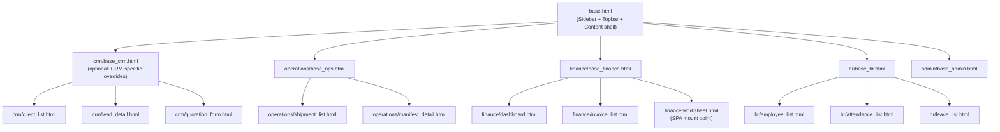

> [!NOTE]
> Setiap `base_<module>.html` **opsional** — hanya dibutuhkan jika modul tersebut perlu override tertentu (misal accent color, extra CSS/JS). Jika tidak ada perbedaan, halaman bisa langsung `` seperti di CRM-Paketin saat ini.
---

## 11. Fase Refinement & Additional Requests (Agustus 2026)

Berdasarkan permintaan terbaru, berikut adalah item yang ditambahkan ke dalam master plan untuk dieksekusi:

1. **Master Data CRUD Frontend**: 
   - Membuka fitur *Create, Read, Update, Delete* (CRUD) secara langsung di antarmuka ERP (di luar Django Admin) untuk seluruh Master Data, termasuk model **Vehicle / Kendaraan**, sehingga admin bisa input manual.
2. **Penggabungan Role User**: 
   - Menggabungkan entitas Driver dan Sales ke dalam model User tunggal yang dilengkapi dengan *role/category* sehingga bisa difilter di master data pengguna.
3. **Integrasi Peta (Map) dengan Master Data**: 
   - Menghubungkan grafik Peta di Dashboard Utama langsung dengan tabel Branch (Cabang) dan Shipment dari database agar otomatis menyesuaikan (dinamis) setiap ada penambahan cabang baru. 
4. **Grafik Klien Pagination**: 
   - Menambahkan fitur geser (Next/Prev) pada grafik *Top 5 Klien Pengirim / Destinasi* di Dashboard Utama agar bisa melihat daftar ke-6, ke-7, dan seterusnya.
5. **Global Dashboard Filter**: 
   - Mengubah tombol filter dashboard (yang tadinya hanya "Berdasarkan Sales") menjadi "Kategori Filter" (Sales, Driver, Admin) agar dapat mengakomodasi semua modul (HR, Ops, Finance).
6. **Perbaikan Logika Kehadiran (HR)**: 
   - Memastikan widget Kehadiran (Absensi) di dashboard me-reset metrik hr_present dan hr_absent setiap harinya secara *real-time*, ditambah dengan penanda *Tanggal Hari Ini*.
7. **Permission Superadmin (Finance)**: 
   - Memberikan hak penuh kepada *Superadmin* untuk dapat menghapus data di modul Invoice & Billing. 
   - Menerapkan konsep *Otomatis Draft*: Saat resi (waybill) berstatus *Delivered*, sistem akan membuat *Invoice Draft* secara otomatis tanpa langsung di-publish (memberi fleksibilitas ke Finance).
8. **UI/UX Cleanup**: 
   - Menghilangkan duplikasi Navbar pada modul Finance (Worksheet, Rekap, dll) karena ERP sudah memiliki menu navigasi utama (Sidebar).
