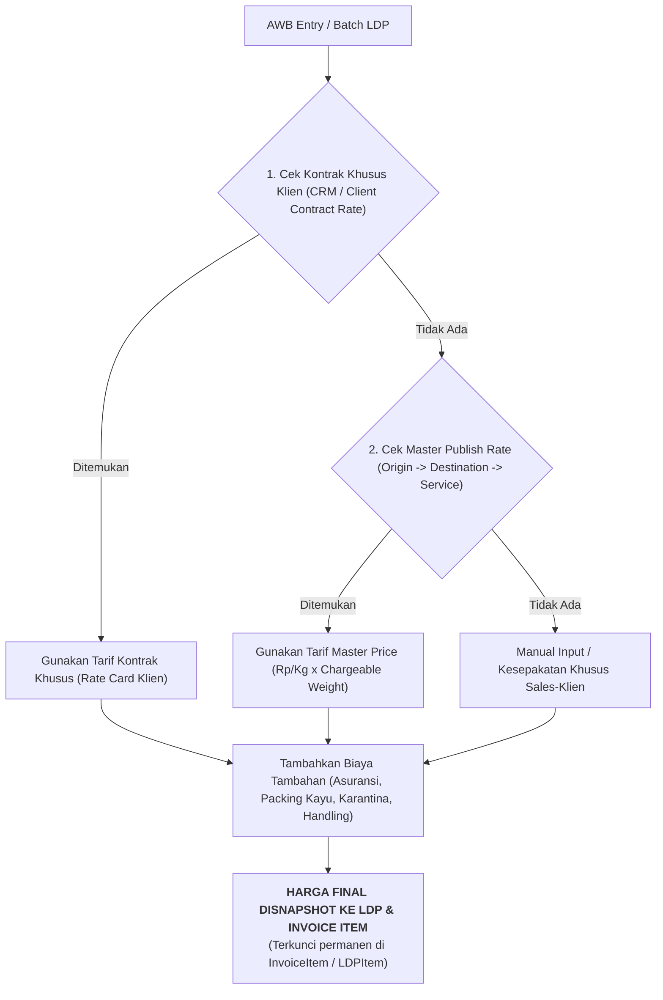
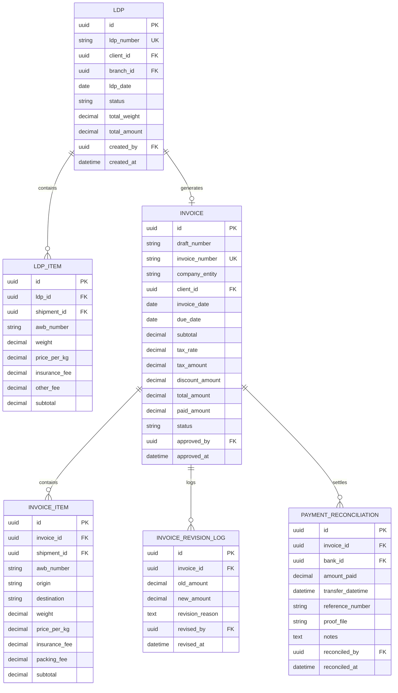

# 💼 ERP Paketin — Finance & Billing Implementation Plan

> **Dokumen Perencanaan Arsitektur & Implementasi Modul Keuangan Terpadu (Operational-to-Finance Pipeline)**  
> **Versi:** 1.0 | **Tanggal:** 21 September 2026 | **Target Modul:** `apps/finance`, `apps/operations`, `apps/master`

---

## 📋 Daftar Isi
1. [Latar Belakang & Tujuan](#1-latar-belakang--tujuan)
2. [Arsitektur & Hirarki Penentuan Harga (Pricing Engine)](#2-arsitektur--hirarki-penentuan-harga-pricing-engine)
3. [Struktur Menu & Navigasi](#3-struktur-menu--navigasi)
4. [Alur Kerja End-to-End (Operational to Finance)](#4-alur-kerja-end-to-end-operational-to-finance)
5. [Skema Database & Model Data (ERD)](#5-skema-database--model-data-erd)
6. [Rincian Scope & Tahapan Implementasi (Phased Roadmap)](#6-rincian-scope--tahapan-implementasi-phased-roadmap)
7. [Desain UI/UX & Standar Tampilan Multi-Tab](#7-desain-uiux--standar-tampilan-multi-tab)
8. [Standar Cetak PDF Invoice & Lampiran LDP](#8-standar-cetak-pdf-invoice--lampiran-ldp)

---

## 1. Latar Belakang & Tujuan

Modul Keuangan (**Finance & Billing**) dalam ERP Paketin menghubungkan seluruh data operasional pengiriman (AWB, Manifest, POD, DO Balik) menjadi siklus penagihan piutang (*Accounts Receivable - AR*) dan hutang vendor (*Accounts Payable - AP*) yang akurat, transparan, dan memiliki kepatuhan audit tinggi.

### Sasaran Utama:
1. **Pemisahan Menu LDP & Invoice**: Menyediakan menu **LDP (Lembar Daftar Pengiriman)** tersendiri sebagai sarana batching resi dan rekapitulasi pengiriman sebelum diajukan ke tagihan.
2. **Multi-Tab Invoice & Billing**: Pengelolaan terpusat untuk **Invoice Klien (AR)**, **Invoice Vendor (AP)**, dan **Siklus / Rekapitulasi Tagihan**.
3. **Data Immutability & Pricing Snapshot**: Nilai tarif, berat, dan biaya tambahan terkunci permanen pada saat LDP / Draft Invoice diterbitkan. Perubahan master tarif di kemudian hari tidak akan merubah nilai invoice historis.
4. **Approval Workflow & Revision History**: Mekanisme verifikasi PIC, nomor invoice resmi, serta pencatatan audit log jika terjadi negosiasi/diskon susulan.
5. **Payment Reconciliation**: Pencatatan pelunasan, upload bukti transfer, pencocokan rekening bank, dan penutupan piutang (*settlement*).

---

## 2. Arsitektur & Hirarki Penentuan Harga (Pricing Engine)

Penentuan tarif per resi/AWB yang masuk ke dalam penagihan mengikuti hirarki 3 lapis:



### Formula Perhitungan Tagihan Resi:
$$\text{Chargeable Weight} = \max(\text{Berat Aktual}, \text{Berat Volumetrik})$$
$$\text{Freight Charge} = \text{Chargeable Weight} \times \text{Tarif per Kg}$$
$$\text{Biaya Tambahan} = \text{Asuransi} + \text{Packing Kayu} + \text{Karantina} + \text{Handling}$$
$$\text{Subtotal Resi} = \text{Freight Charge} + \text{Biaya Tambahan} - \text{Diskon}$$
$$\text{Total Invoice} = \sum(\text{Subtotal Resi}) + \text{PPN (jika berlaku)}$$

---

## 3. Struktur Menu & Navigasi

Di dalam Sidebar Navigasi ERP Paketin, modul **FINANCE** disusun menjadi:

```
FINANCE
├── 1. Worksheet (Kalkulator & Analisa Cepat)
├── 2. LDP - Lembar Daftar Pengiriman (Batching & Rekap Resi Terkirim)
├── 3. Invoice & Billing (Multi-Tab: Invoice Klien, Invoice Vendor, Rekap Tagihan)
├── 4. Rekonsiliasi & Kas/Bank (Pencocokan Pembayaran & Settlement)
├── 5. Laporan Keuangan & Aging AR/AP
└── 6. Master Vendor Keuangan
```

---

## 4. Alur Kerja End-to-End (Operational to Finance)

```mermaid
stateDiagram-v2
    direction LR
    [*] --> Operasional_POD: AWB Delivered / DO Balik Validated
    Operasional_POD --> LDP_Batching: 1. Input Batch LDP (Pilih Klien, Tanggal, Cabang)
    LDP_Batching --> Draft_Invoice: 2. Generate Draft Invoice (Snapshot Harga)
    Draft_Invoice --> Official_Invoice: 3. Crosscheck & Approval PIC (No. Invoice Resmi)
    Official_Invoice --> Sent_Client: 4. Kirim Invoice + Lampiran LDP ke Klien
    Sent_Client --> Reconciled_Paid: 5. Rekonsiliasi & Upload Bukti Bayar
    Reconciled_Paid --> [*]: 6. Lunas / Closed
```



### Rincian 5 Langkah Utama:

#### Tahap 1: LDP (Lembar Daftar Pengiriman)
- **Fungsi**: Wadah pengelompokan AWB yang siap tagih (berstatus *Delivered* atau *DO Balik Tervalidasi*).
- **Proses Input**:
  - Filter berdasarkan: Nama Klien B2B, Rentang Tanggal Pengiriman, Cabang Asal/Tujuan.
  - Sistem menampilkan daftar *Unbilled AWBs*.
  - User memilih AWB (Centang Semua / Parsial).
  - Sistem membuat dokumen LDP dengan nomor unik (contoh: `LDP/BJM/2026/09/0001`).
  - Dokumen LDP dapat dicetak sebagai lembar rekapitulasi resi bertanda tangan serah terima.

#### Tahap 2: Generate Draft Invoice
- Dari satu atau beberapa nomor LDP, finance menekan tombol **"Generate Draft Invoice"**.
- Sistem menyalin (*snapshot*) seluruh komponen harga, berat, data pengirim, data penerima, dan surcharges ke tabel `InvoiceItem`.
- Dihasilkan nomor draft sementara (contoh: `DRAFT-INV/2026/09/0012`).

#### Tahap 3: Crosscheck, Negosiasi & Approval PIC
- Tim Finance & PIC Sales melakukan verifikasi nominal tagihan, kesesuaian berat, dan kelengkapan lampiran.
- **Jika ada perubahan / penyesuaian khusus**:
  - Nilai disesuaikan pada item invoice.
  - Perubahan otomatis tercatat pada `InvoiceRevisionHistory` (mencatat nominal lama, nominal baru, alasan, user, dan timestamp).
- **Approval**:
  - PIC Finance / Supervisor menekan tombol **"Approve & Terbitkan Invoice Resmi"**.
  - Sistem menerbitkan Nomor Invoice Resmi (contoh: `INV/AMP/2026/09/0045`).

#### Tahap 4: Pengiriman & Penagihan ke Klien
- Invoice resmi dicetak menggunakan format kop surat perusahaan yang dipilih (PT Amanah / PT Sarana / PT Sinergi).
- Invoice resmi dilampiri dokumen LDP (Rincian AWB) dan dikirimkan ke pihak klien.
- Status invoice: `UNPAID` dengan tanggal jatuh tempo (*Due Date*).

#### Tahap 5: Rekonsiliasi Pembayaran (Payment Reconciliation)
- Saat klien melakukan transfer pembayaran:
  - Finance membuka modul **Reconcile**.
  - Memilih invoice yang dibayarkan.
  - Menginput: Bank Tujuan (BCA/Mandiri/BNI), Nomor Rekening, Tanggal & Jam Transfer, Nominal Bayar (Full / Partial), serta mengunggah **Foto/PDF Bukti Transfer**.
- Jika nominal sudah lunas ($100\%$), status berubah menjadi `PAID`.
- Otomatis memperbarui laporan arus kas dan *AR Aging Report*.

---

## 5. Skema Database & Model Data (ERD)



---

## 6. Rincian Scope & Tahapan Implementasi (Phased Roadmap)

### 📌 Fase 1: Pembuatan Model Data LDP & Snapshot Pricing Engine
* [x] Model `LDP`, `LDPItem`, `InvoiceRevisionLog`, dan `PaymentReconciliation` di `apps/finance/models.py`.
* [x] Migration database dan integritas relasi foreign key.
* [x] Penomoran LDP & Invoice seragam berbasis cabang tanpa tanda hubung minus (`BKSLDP2609210001`, `BKSINV2609210001`).

### 📌 Fase 2: Menu Terpisah LDP (Lembar Daftar Pengiriman)
* [x] Menu **LDP** pada sidebar navigation `templates/base.html`.
* [x] Tampilan list LDP (single tab layout seragam menu operasional: `ldp_list.html`).
* [x] Form Entry LDP (`ldp_form.html` sesuai Foto 2 & struktur menu Transit: scan barcode, take out, copy table, default empty date `dd/mm/yyyy`).
* [x] Template cetak LDP (`ldp_print.html`) untuk lampiran resmi.

### 📌 Fase 3: Menu Multi-Tab "Invoice & Billing"
* [x] Multi-Tab di `apps/finance/templates/finance/invoice_list.html` (Invoice Klien AR & Invoice Vendor AP).
* [x] Pembuatan Invoice dari Batch LDP Customer (`invoice_form.html` sesuai Foto 4 dengan preview total dan breakdown AWB).

### 📌 Fase 4: Dedicated Menu "Invoice Process" (Approval & Reconcile)
* [x] Menu tersendiri **Invoice Process** di sidebar.
* [x] **Tab 1: Approval Invoice** — Review draft invoice, pemilihan entitas PT resmi (PT Amanah / PT Sarana / PT Sinergi), jatuh tempo, dan approval resmi.
* [x] **Tab 2: Reconcile Invoice** — Rekonsiliasi pembayaran (Input No Inv, Tanggal Transfer, Bank Tujuan, Upload Bukti Transfer, dan Update Status Pelunasan).

### 📌 Fase 5: Modul Rekonsiliasi Pembayaran & Cetak PDF Resmi
* [x] Form & Modal **Reconcile**: Pencatatan pelunasan, upload foto bukti bayar, update status `PAID`/`PARTIAL`, dan sinkronisasi KPI.
* [x] Standarisasi template PDF Invoice resmi & cetak LDP lampiran.

---

## 7. Desain UI/UX & Standar Tampilan Multi-Tab

Halaman **Invoice & Billing** dan **LDP** menggunakan standar UI modern ERP Paketin:
1. **Navigasi Tab Dinamis**: Menggunakan pill tab dengan indikator badge jumlah dokumen aktif (tanpa background putih berlebih).
2. **Action Button Seragam**: Tombol aksi dropdown (`btn-danger rounded-pill px-3`) yang konsisten dengan modul Operasional (Pickup, Manifest, DO Balik, Retur).
3. **Filter Interaktif**: Date range picker (Flatpickr), select2 dropdown untuk Customer dan Cabang, serta quick search bar.
4. **Modal Konfirmasi Anti-Hapus Tidak Sengaja**: Konfirmasi hapus dan pembatalan invoice menggunakan modal interaktif.

---

## 8. Standar Cetak PDF Invoice & Lampiran LDP

1. **Format Lembar Utama (Invoice)**:
   - Header: Kop Resmi PT Amanah / PT Sarana / PT Sinergi lengkap dengan alamat & NPWP.
   - Kolom Kepada: Nama Perusahaan Klien, Alamat, PIC & Kontak.
   - Ringkasan Tagihan: Nomor Invoice, Tanggal Invoice, Tanggal Jatuh Tempo, Nomor LDP terkait.
   - Tabel Rincian Singkat (Periode Pengiriman, Total Resi, Total Berat, Total Tagihan, PPN, Grand Total).
   - Petunjuk Pembayaran: Daftar Nomor Rekening Bank Resmi (BCA, Mandiri, BNI).
   - Tanda Tangan: Finance Manager & Direksi.
2. **Format Lembar Lampiran (LDP Breakdown)**:
   - Tabel detail seluruh AWB dalam invoice (No AWB, Tanggal Kirim, Asal, Tujuan, Penerima, Berat Kg, Layanan, Ongkir, Biaya Tambahan, Total).
